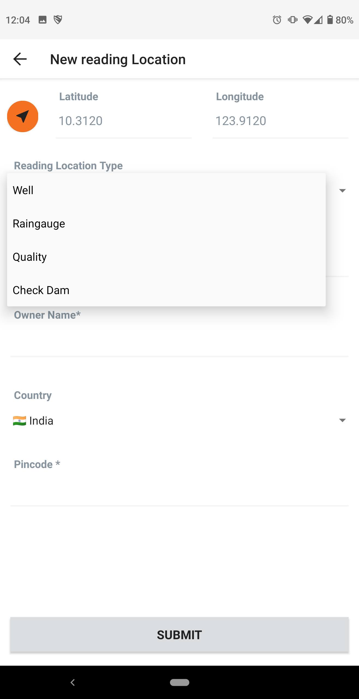

# OurWater Documentation

## Specifications:

- [Firestore 'Schema'](./firestore_structure.md)
- [Short Id](./short_id_specification.md)
- [QR Codes](./qr_codes.md)

## Data Flows:

### 1. Saving a reading
### 2. Creating a new resource

1. From homepage click 'New'
2. Fill out form and click 'Submit'
3. `MyWellApi.saveResource()`
4. `firestore.collection('org').doc(orgId).collection('user').doc(userId).collection('pendingResources').doc(resource.id).set(resource);`
5. Navigate to 'Save Pending Resources'
6. Select 'Sync'
7. `MyWellApi.runInternalSync()`
8. `POST /resource/{orgId}/{userId}/sync`
9. User's new resources are now available publicly

### 3. Creating a new user and signing in
### 4. Approving Users

## Screenshots

 
 
 

 
 
 

 
 
 

 
 
 

