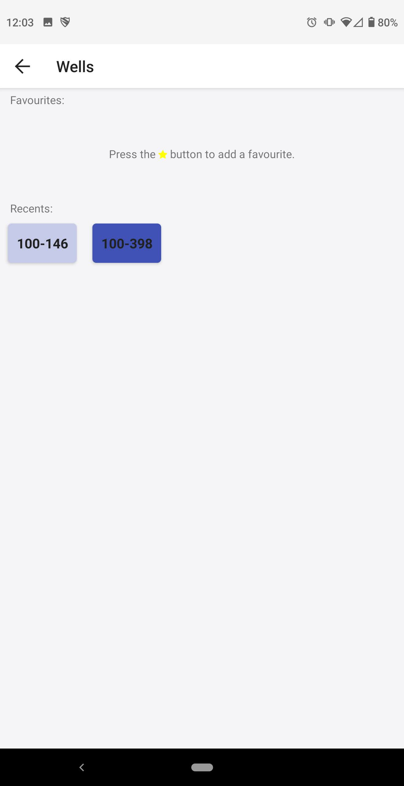

# Our Water

OurWater is an open source, whitelabeled version of MyWell. 


<div>
  
  
  
</div>


## Documentation

See the full [documentation here](./docs)

## Screenshots


## Getting Started

### Env Files

To cater to all the different build environments, we have many env files which get compiled into one in the `make switch` tasks.

For each `env.<org>.<stage>.sh` file, there should also be a `.env.<org>.<stage>.sh`.  
Refer to `example.env.deployment.sh` and `example.env.org.stage.sh` for the .env files for ow_client, and  
`example.env.firebase.stage.sh` for the .env files for ow_firebase.


## Installing

OurWater is comprised of several sub-projects, which are maintained in this repo.

```
.
├── docs                   
├── env                    # Shared Env variables for all sub projects
├── ow_admin               # [DEPRECATED] Admin Tools and Site
├── ow_client              # React Native OurWater Project
├── ow_common              # Common tools shared between ow_client and ow_firebase
├── ow_firebase            # MyWell Firebase Project
├── ow_test                # [DEPRECATED] Automated test tools. This has been delegated to each project.
├── ow_translations        # Shared translations
├── ow_types               # [DEPRECATED] Shared Type definitions. Use ow_common instead,
├── LICENSE
└── README.md

```

### ow_client

```
touch /tmp/ow_client            #set the environment variables
make switch-<org>-<environment> #eg. make switch-mywell-dev

make server                     #run in separate shell
make android                    #run development mode on Android device or emulator
```


### ow_firebase

```
touch /tmp/ow_firebase_env
make switch-<environment>      #eg. make switch-dev
make install

make run-local                 #run the local firebase server
```


## Testing

Each subproject maintains its own testing environment, which adheres to the following 

We use 3 types of tests:
1. Unit tests, defined in `*.unit.ts` files
2. Service tests, defined in `*.service.ts` files, and
3. Full Integration tests, written and maintained in the `/ow_test` root folder

Broadly, Unit tests will test one specific function and mock out any dependencies, service tests test a specific service and will rely on dependencies (such as Cloud Firestore), and full integration tests tie together a number of services together.


## Packages to remove:

- fast-deep-equal (only used once)
- react-native-vector-icons - used only twice
- fork react-native-camera and remove lodash, which is only used once, or at least make it a peer dependency


## OurWater Firebase Endpoints
- https://us-central1-our-water.cloudfunctions.net/{api}/{orgId}/{method}  
- http://localhost:5000/our-water/us-central1/{api}/{orgId}/{method}  
- https://ourwater.localtunnel.me/our-water/us-central1/{api}/{orgId}/{method}  